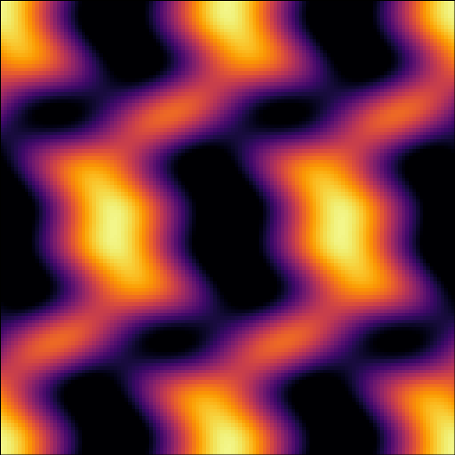
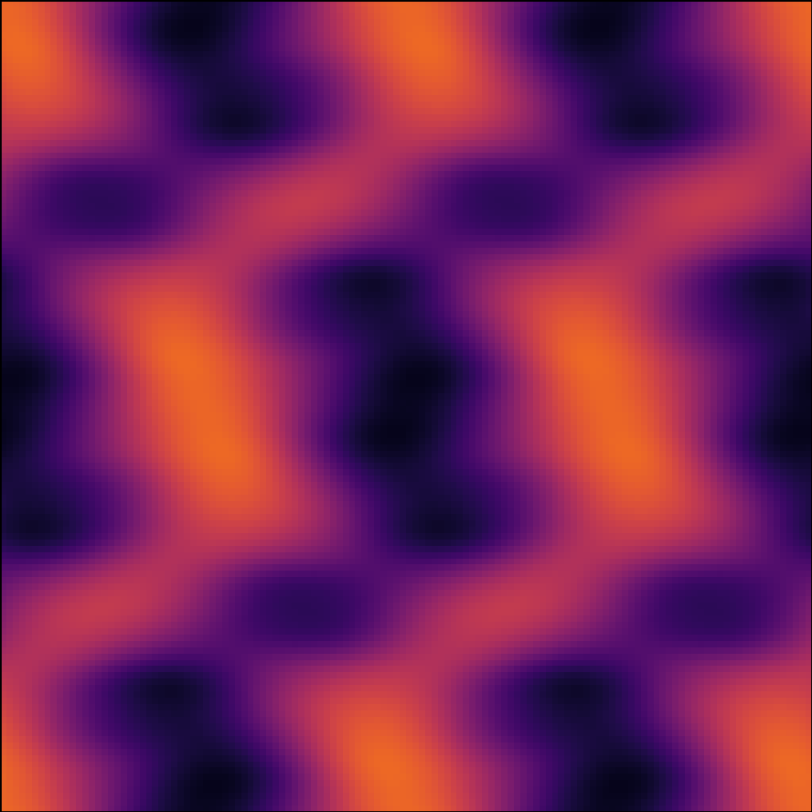
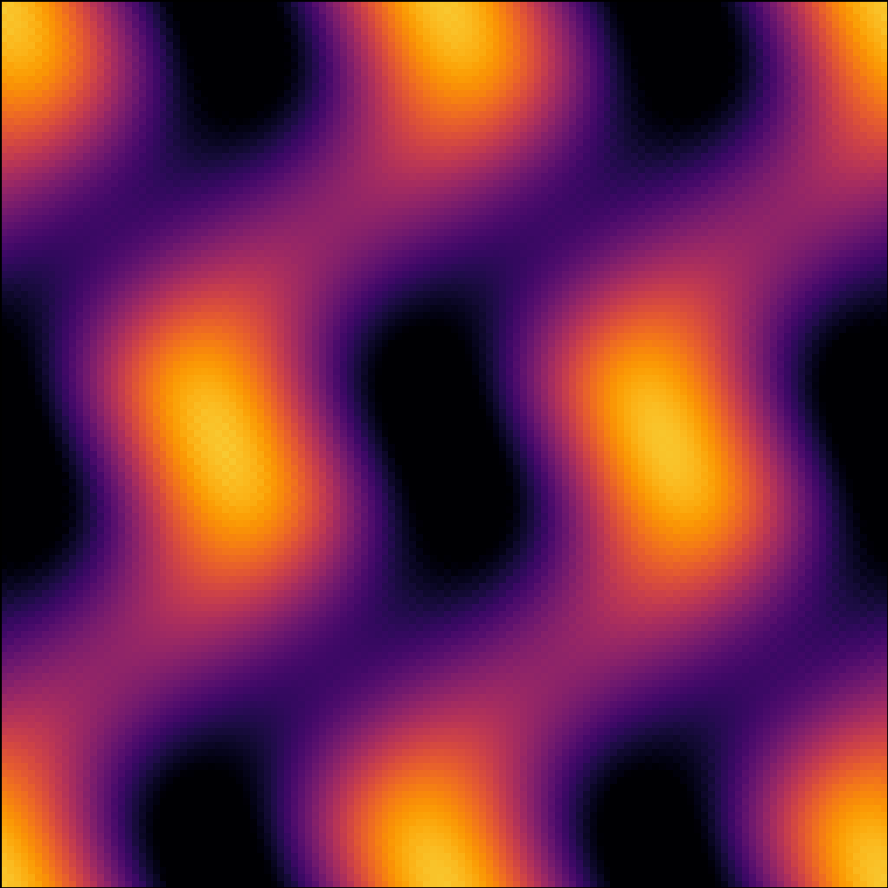

# Quantum Isothermal

Philip Mocz (2025)

Study the correspondence between the Compressible Isothermal Euler Equations and a Quantum Schrodinger-type Equation

## Comparison

| Isothermal | Quantum (m=100) | Quantum (m=10) |
|--|--|--|
|  |  |  |
